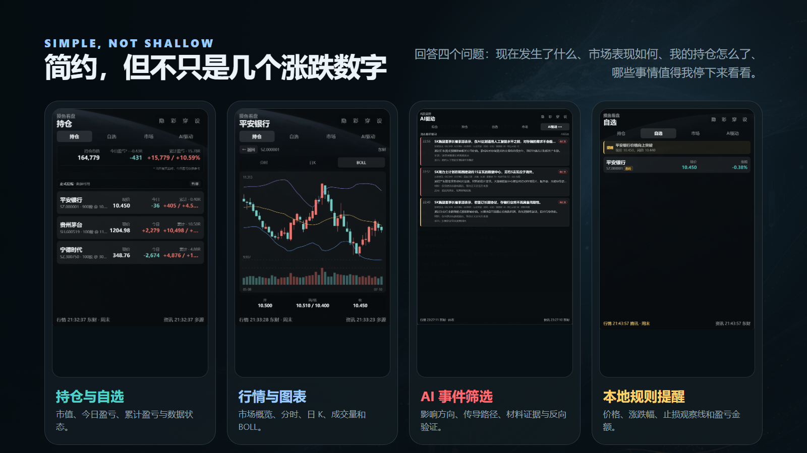
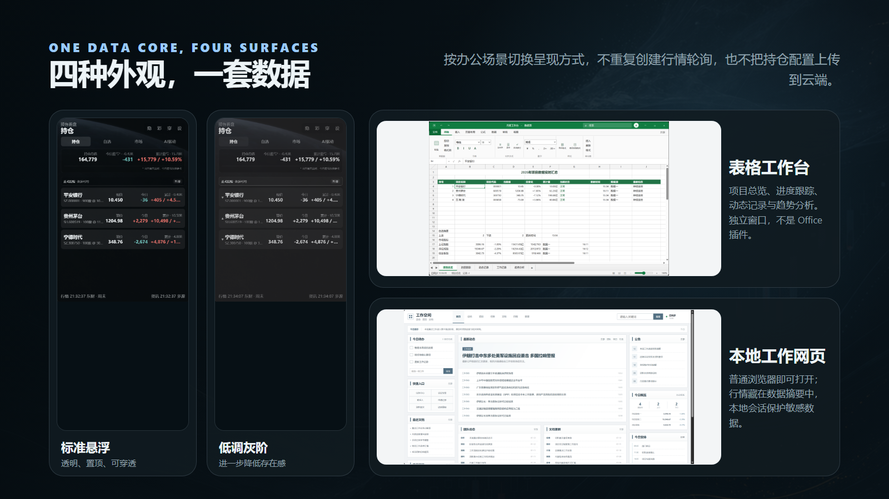
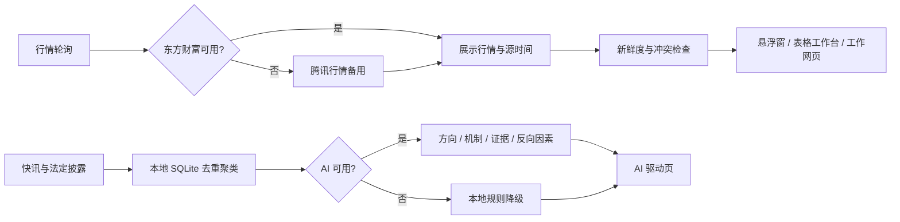

<div align="center">
  
</div>

<h1 align="center">摸鱼看盘</h1>

<p align="center">
  一个面向办公场景的本地 A 股看盘工具。<br />
  行情软件负责专业，它负责低调。
</p>

<p align="center">
  <code>Electron</code>
  <code>TypeScript</code>
  <code>Windows</code>
  <code>macOS</code>
  <code>Local-first</code>
  <code>OpenAI-compatible</code>
  <code>Source available</code>
</p>

> [!IMPORTANT]
> 本项目源码公开，但采用 [PolyForm Noncommercial License 1.0.0](LICENSE)，不属于 OSI 定义的开源软件。个人可以免费使用、学习、修改和进行非商业分享；禁止打包售卖、付费代装、集成进商业产品或用于其他商业服务。

> [!NOTE]
> 文档和截图中的持仓、成本、提醒条件均为公开模拟数据。本项目只提供信息展示、规则计算和新闻辅助阅读，不预测涨跌、不自动交易，也不构成投资建议。

## 下载

| 平台 | 当前版本 | 架构 | 安装包 |
| --- | --- | --- | --- |
| Windows | v0.1.0 | x64 | [下载安装程序](https://github.com/Doubixilin/moyu-kanpan/releases/download/v0.1.0/moyu-kanpan-0.1.0-windows-x64-setup.exe) |
| macOS | v0.1.1 | Apple Silicon | [下载 DMG](https://github.com/Doubixilin/moyu-kanpan/releases/download/v0.1.1/moyu-kanpan-0.1.1-macos-arm64.dmg) |

两个平台当前发布版本号不同，请按平台选择，不要交叉安装。安装包尚未进行商业代码签名或 Apple 公证，Windows SmartScreen 或 macOS Gatekeeper 可能显示安全提示；请只从本仓库 [Releases](https://github.com/Doubixilin/moyu-kanpan/releases) 下载，并自行核对发布说明。

## 为什么做它

办公时偶尔想看一眼行情，通常并不需要打开完整行情终端。真正想确认的无非是几件事：

- 现在发生了什么？
- 市场整体表现如何？
- 我的持仓和自选有什么变化？
- 有没有值得立即停下来核验的新闻或警戒线？

摸鱼看盘把这些信息放进一个透明、可置顶、可以随时隐藏的桌面小窗，同时保留图表、来源状态、AI 新闻筛选和本地提醒等必要能力。

<div align="center">
  
</div>

## 核心能力

| 方向 | 能做什么 |
| --- | --- |
| 行情 | 自选与持仓报价、市场指数、涨跌家数、成交数据、更新时间和数据来源 |
| 图表 | 分时、日 K、成交量、OHLC 与 BOLL 布林线 |
| 持仓 | 持仓市值、相对昨收的今日盈亏估算、相对成本的累计盈亏 |
| 新闻 | 财经快讯、法定公告、交易所公告与监管政策，多来源去重和聚类 |
| AI | 使用 OpenAI-compatible API 分析事件方向、影响机制、证据材料与反向因素 |
| 降级 | 没有 API Key 或模型不可用时自动使用本地规则，不让新闻区域直接失效 |
| 提醒 | 价格突破、止损/观察线、涨跌幅、今日及累计盈亏金额等本地机械规则 |
| 数据健康 | 主备行情源回退、新闻源退避重试、缓存状态、延迟与冲突提示 |
| 配置 | 设置页手动维护，也可以导入由 Coze 或其他智能体生成的 JSON 配置包 |

## 四种外观，一套数据

<div align="center">
  
</div>

### 标准悬浮与低调灰阶

- 透明、无边框、置顶和不透明度调节。
- 支持点击穿透、位置与尺寸锁定。
- 支持全局老板键快速呼出或隐藏。
- 可以只在托盘驻留，不长期占用任务栏。

### 表格工作台

将同一份行情快照整理成项目总览、进度跟踪、动态记录、工作记录和趋势分析等工作表。行情变化只更新对应单元格，切换工作表和当前选区不会被刷新打断（趋势图会重绘，但工具条与项目下拉保持不动）。

它是摸鱼看盘自己的独立窗口，不是 Microsoft Excel 插件，不读取或写入 XLSX，也没有公式、宏和完整电子表格内核。

### 本地工作网页

由应用在 `127.0.0.1` 随机端口提供一个普通工作网页，行情只作为页面中的低调“数据摘要”。页面使用受保护的本机会话和 SSE 更新，同一台电脑打开多个标签页也不会让上游行情请求成倍增加。

公开网页快照明确排除 API Key、持仓数量、成本价、账户规模、原始新闻地址和本机文件路径。应用退出后，本地端口和连接会一起关闭。

## 行情与新闻如何降级



- 行情默认使用东方财富，超时、失败或空数据时切换腾讯行情。
- 法定披露优先作为事实根节点；巨潮失败时按市场回退到上交所或深交所公告。
- 单一新闻源失败时保留历史事件并退避重试，不把抓取失败解释成“没有新闻”。
- 所有外观共享同一套 provider 和轮询调度，不为每个窗口重复请求上游接口。

## AI 不是荐股按钮

AI 的任务是帮助筛选和阅读事件，而不是替用户给出买卖结论：

- 判断事件更可能影响公司、行业还是整体市场。
- 说明可能的传导路径和观察窗口。
- 区分标题线索、官方材料与尚未完成的交叉验证。
- 主动列出反向因素，避免把单一叙事包装成确定结论。
- AI 请求不会读取持仓数量、成本价或账户规模。

默认可配置 DeepSeek，也支持其他 OpenAI-compatible API。API Key 由 Electron 主进程通过系统安全存储加密保存，不进入普通设置文件、配置导出包或新闻数据库。

## 提醒负责机械计算，你负责冷静

提醒规则全部在本地计算，可配置：

- 止损价、观察线、向上或向下突破价。
- 当日涨跌幅。
- 今日及累计盈亏金额。
- 账户或风险组的仓位、数量和损益约束。
- 交易时段限制、冷却时间、每日次数和回差。
- 影子模式、悬浮窗高亮、托盘状态和静音系统通知。

影子模式只记录触发，不主动打扰，适合在正式启用规则前观察误报情况。

## 快速开始

### 从源码运行

需要 Node.js 22 或更高版本。

```bash
git clone https://github.com/Doubixilin/moyu-kanpan.git
cd moyu-kanpan
npm install
npm test
npm start
```

### Windows 打包

```bash
npm run package:win
```

构建产物生成在 `release/`。发布前建议再次人工检查透明窗口、置顶、托盘、点击穿透、系统通知和老板键。

## 配置与迁移

日常配置直接在设置窗口完成，包括：

- 页面和默认视图。
- 持仓、自选与显示字段。
- 新闻筛选和 AI API。
- 警戒线、提醒策略与风险组。
- 窗口行为、快捷键和外观。

配置导入支持“合并”和“替换”两种模式。设置页可以复制一段交接提示词，交给 Coze 或其他智能体根据用户提供的持仓、自选和交易纪律生成结构化 JSON；应用会先校验并预览差异，确认后才写入本地配置。

仓库中的 [`config/example-profile.json`](config/example-profile.json) 是公开模拟组合，只用于展示字段结构和影子提醒，不会自动成为真实用户配置。

## 开发与验证

需要 **Node.js 24**（`src/services/newsEvents.ts` 使用 `node:sqlite`，该模块在 Node 22.x 仍需 `--experimental-sqlite`）。

```bash
npm install
npm run verify        # 类型检查 + lint + 格式检查 + 单元测试 + 构建（推荐，等价于 CI）
npm test
npm run test:coverage # 单元测试 + 覆盖率门槛（阈值见 .c8rc.json）
npm run lint
npm run format        # prettier 自动格式化
npm run typecheck
npm run build
npm run smoke:data
npm run smoke:news
```

`npm run verify` 串起 CI 的全部检查；`.github/workflows/ci.yml` 在每次 push 与 PR 上执行同样的步骤（测试一步用 `test:coverage`，覆盖率低于 `.c8rc.json` 里的阈值会失败）。

ESLint 使用类型感知规则（`typescript-eslint` 的 `recommendedTypeChecked`）并额外收紧 `no-explicit-any`、`no-floating-promises`、`no-unused-vars`；规则与豁免理由见 `eslint.config.mjs`。代码风格由 Prettier 统一（`printWidth: 100`、无行尾逗号），`docs/` 与 `*.css` 不在其管辖范围（中文排版与样式表另行处理）。

覆盖率是**回归下限**（略低于当前实测值），不是质量目标——当前实测约为行 91%、分支 74%、函数 91%。

真实接口的 smoke（`smoke:data` / `smoke:news`）依赖外网、结果会随行情波动，因此不进 CI，发布前手动执行。

项目使用 TypeScript 编写，Electron 主进程负责 provider、轮询、配置、安全存储、窗口与本地网页服务；各个渲染界面只消费经过整理的 ViewModel 或脱敏快照。

## 已知边界

- 使用的是公开网页端数据接口，没有交易所直连和 SLA，不应替代券商或专业行情终端。
- 今日盈亏以当前持仓相对昨收估算；当天发生加仓、减仓或做 T 时，不具备券商逐笔成交口径。
- 累计盈亏根据当前数量、现价和用户维护的成本价计算，交易后应及时同步持仓数量和成本。
- 年度休市日需要随新年度版本维护；未收录年份会退化为工作日和周末判断。
- AI 输出可能遗漏、误判或产生不可靠解释，重要事件应回到原始公告和专业数据源核验。

## 许可证与免责声明

[PolyForm Noncommercial License 1.0.0](LICENSE)

- 允许：个人免费使用、学习、修改和保留许可证的非商业分享。
- 禁止：售卖、付费代装、商业集成、商业托管或其他以本项目获利的服务。

本工具不预测涨跌、不自动交易，也不构成投资建议。

**摸鱼可以，投资请自己负责。**
