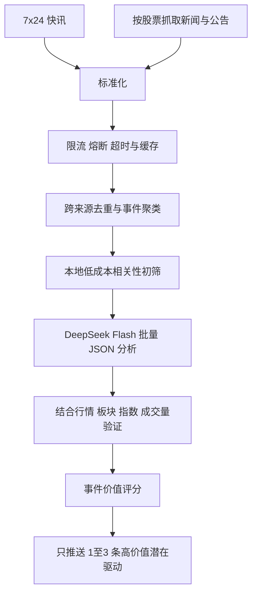

# 个人悬浮看盘优化方案

> 状态：讨论结论已确认，待分阶段实施
> 日期：2026-07-10
> 适用范围：个人 Windows 看盘工具；暂不考虑分发便利性和 macOS 适配

## 1. 目标与边界

本应用不是缩小版行情软件，也不是新闻阅读器。核心目标是：

1. 用一个低干扰、始终置顶的小窗口快速查看持仓、自选和市场状态。
2. 只显示经过 AI 筛选的少量高价值事件，并解释它们可能如何影响股价。
3. 默认带入用户自己的持仓和自选，不要求首次使用时重新录入。
4. 所有个人持仓和 API 凭据只保存在本机，不进入 Git 默认配置。

窗口应保持紧凑，不能为了容纳更多信息扩展成占满屏幕一侧的长面板。内容超出时应通过 Tab、分页、折叠或局部滚动处理，而不是持续增加窗口高度。

## 2. 已确认的产品方案

### 2.1 默认 Tab 与自定义 Tab

内置 Tab：

- `持仓`：数量、成本、现价、市值、浮动盈亏和驱动提示。
- `自选`：全部自选股票，支持字段和排序配置。
- `市场`：主要指数、涨跌分布、成交额和市场强弱摘要。
- `AI 驱动`：只显示经过筛选和市场验证的重要事件。
- `综合`：少量行情加 1–2 条 AI 驱动，作为可选紧凑首页。

用户可以：

- 选择默认 Tab，或选择记住上次停留页面。
- 调整 Tab 顺序、显示或隐藏内置 Tab。
- 从模板添加多个自定义 Tab。
- 重命名、复制和删除自定义 Tab。

自定义 Tab 使用模板，不做自由拖拽画布：

- 股票列表：选择股票子集、字段、排序方式。
- 持仓分组：长期、短线或其他个人分组。
- 市场概览：选择指数和市场指标。
- 新闻专题：按股票、优先级、事件类型或关键词筛选。
- 综合页面：行情模块加少量 AI 驱动。

顶部只显示约 4–5 个文字 Tab，更多页面进入 `…` 菜单。点击穿透开启时，仍可通过托盘菜单切换页面。

### 2.2 紧凑信息布局

- 默认窗口继续保持约 `380 × 520` 的小尺寸。
- 窗口高度不得因自选数量或新闻数量自动无限增长。
- 行情/持仓页以行情为主，AI 驱动区域最多占约三分之一。
- 默认页最多显示 2 条 AI 驱动；AI 驱动专页建议最多显示 5 条。
- 没有高价值事件时显示“暂无重要驱动”，不使用普通快讯填满空间。
- 保留标准彩色和低调灰阶两种模式；低调模式使用明暗、字重和箭头表达涨跌与优先级。

### 2.3 个人初始化配置

个人数据不写入 `config/defaults.json`、README 或本方案，也不进入 Git 历史。实施时创建被 `.gitignore` 排除的本地初始化文件，例如：

```text
config/personal.local.json
```

首次启动流程：

1. 本地用户设置不存在时，读取个人初始化文件。
2. 将持仓、自选和默认 Tab 导入 Electron `userData` 设置。
3. 写入初始化完成标记，后续启动不再覆盖用户修改。
4. 本地设置已存在时，绝不重新套用初始化数据。

用户已通过截图确认一组实际持仓和自选。实施时按已确认数据写入本地文件：

- 当前持仓共 4 项，保存代码、名称、数量和成本价。
- 自选共 18 项，按截图顺序导入。
- 持仓股票同时属于自选，但行情层只请求一次。
- 零持仓的历史项目不作为当前持仓导入。
- 当前价、当日盈亏、可用数量、总资产和现金均为动态数据，不写入初始化配置。
- 不创建“北极星”或其他来源型 Tab，只使用普通的“持仓”和“自选”。

## 3. AI 配置方案

### 3.1 设置界面

设置窗口增加“AI 分析”区域：

- 启用/停用 AI。
- 服务商预设：DeepSeek 官方、自定义 OpenAI-compatible。
- Base URL。
- API Key 密码框，支持显示/隐藏、替换和清除。
- 模型名称，DeepSeek 默认 `deepseek-v4-flash`。
- 思考模式，默认关闭。
- 请求超时。
- 测试连接按钮。
- 最近一次成功时间、当前模型和精简错误状态。

DeepSeek 官方预设：

```text
Base URL: https://api.deepseek.com
Model: deepseek-v4-flash
Thinking: disabled
```

V4 默认开启思考模式；本应用追求及时反馈，请求体必须显式发送：

```json
{
  "thinking": {
    "type": "disabled"
  }
}
```

模型名称仍允许编辑，以兼容其他 OpenAI-compatible 服务商。

### 3.2 凭据安全

- API Key 只进入 Electron 主进程。
- 使用 Electron `safeStorage` 加密后保存；Windows 使用系统提供的凭据保护机制。
- 渲染进程只能获得 `configured: true/false` 和掩码，不得读取完整 Key。
- 设置导出、日志、错误信息和截图中不得包含 Key。
- 保留 `.env` 作为开发或迁移兼容入口，但设置界面配置优先。

### 3.3 AI 输出协议

停止解析“自由文本里是否出现高/中”这种脆弱逻辑，改为 JSON Output。建议事件分析结构：

```json
{
  "useful": true,
  "eventType": "earnings|policy|order|management|capital|industry|market|other",
  "relatedCodes": ["000000"],
  "direction": "positive|negative|neutral|mixed",
  "horizon": "intraday|short|medium|long",
  "importance": 0,
  "confidence": 0,
  "summary": "发生了什么",
  "mechanism": "通过什么路径影响收入、利润、估值或风险偏好",
  "evidence": ["新闻事实"],
  "counterFactors": ["反向因素或不确定性"]
}
```

`importance` 和 `confidence` 使用 `0–100`。AI 只能输出“潜在驱动”和置信度，不能把相关性表述为确定因果。

## 4. 新闻与股价驱动管线

### 4.1 数据源策略

保留东方财富 7×24 快讯作为市场级事件入口，同时增加按持仓/自选股票搜索的个股新闻。后续优先补充公司公告、监管和业绩类来源。

参考旧信息流项目但不整套迁移：

值得复用的设计：

- 按股票代码/名称抓取新闻。
- 主数据源失败时切换备用搜索。
- 东方财富请求统一限流、指数退避和熔断冷却。
- 长正文优先截取股票名称或代码附近的上下文。
- 首轮限量、不同股票错峰抓取。
- 行情异动后关联近期事件进行可能原因分析。

不复用的部分：

- 不引入 Python、FastAPI、AKShare 和 SSE 服务；Electron 主进程与 IPC 已能承担调度和推送。
- 不使用“命中关键词即重大”的单层判断。
- 不对每条原始新闻串行调用一次模型。
- 不使用仅基于 URL 的简单去重。
- 不在 AI 分析成功前永久标记新闻为已处理。

### 4.2 处理流程



建议评分因素：

- 与持仓/自选的相关程度。
- 事件本身的实质性。
- 新颖度，是否首次出现或只是重复转载。
- 来源可信度。
- 影响方向和持续时间。
- 股价、成交量和所属板块是否出现对应反应。
- 信息是否可能已被市场充分反映。
- 时间衰减。

### 4.3 去重、缓存与失败恢复

- 先做 URL、规范化标题和正文指纹去重。
- 再对同一事件的多媒体报道聚类，只保留一个事件卡片和多个来源链接。
- 以事件指纹缓存 AI 结果，避免轮询重复计费。
- AI 分析失败不得直接把事件永久标记为完成；应按退避策略重试。
- AI 不可用时默认页显示“AI 暂不可用”，不能把未经筛选的新闻流伪装成 AI 驱动。
- 本地规则仅作为明确标注的降级模式。

## 5. 股价影响分析

新闻分析和股价归因是两个阶段：

1. 新闻阶段判断事件可能通过什么机制影响公司或板块。
2. 市场验证阶段判断价格表现是否与该机制一致。

最低验证数据：

- 个股涨跌幅和成交量变化。
- 所属行业或概念板块表现。
- 主要指数表现。
- 个股相对板块、相对大盘的强弱。
- 事件发布时间与价格异动时间的先后关系。

最终展示示例：

```text
示例公司｜偏正面｜短期｜置信度 72%
新增订单可能改善收入预期；消息后股价放量并跑赢所属板块。
合同金额占营收比例尚不明确，持续性仍需确认。
```

无法获得足够行情证据时，应写“信息不足”或“可能为板块/资金面驱动”，不能编造确定原因。

## 6. 目标数据模型

### 6.1 证券与持仓

```text
Security
  code
  market
  name
  alias

Holding
  securityCode
  quantity
  costPrice
  groupId
  note

WatchlistMembership
  securityCode
  groupId
  order
  visible
```

同一证券只有一份行情实体，持仓、自选和多个 Tab 只引用它。

### 6.2 页面配置

```text
TabConfig
  id
  type
  title
  builtIn
  visible
  order
  isDefault
  securityCodes
  quoteFields
  quoteSort
  newsFilter
  maxItems
```

内置 Tab 可以隐藏但不真正删除；自定义 Tab 可以删除。

### 6.3 AI 凭据与偏好

普通设置保存服务商、Base URL、模型、思考模式、超时和 `configured` 状态。API Key 使用单独的加密存储，不进入普通设置 JSON。

## 7. 分阶段实施计划

### 阶段 0：收口现有基础改动

- 重新启动开发态 Electron。
- 验证设置窗口不被悬浮窗遮挡。
- 验证自选保存、字段配置、透明度和低调模式。
- 运行测试、构建和真实数据 smoke。

验收：现有第一阶段功能稳定，设置可连续保存，窗口没有“无数据”回归。

### 阶段 1：证券、持仓与 Tab 数据模型

- 建立 `Security`、`Holding`、自选分组和 `TabConfig`。
- 迁移现有单一 watchlist 设置。
- 增加内置 Tab 和模板化自定义 Tab。
- 支持默认页、排序、隐藏和 `…` 溢出菜单。
- 创建被忽略的个人初始化文件并导入用户已确认的数据。

验收：首次启动直接出现正确持仓与自选；没有“北极星”Tab；修改后重启仍保持用户设置。

### 阶段 2：AI 设置与 DeepSeek 接入

- 增加 AI 设置 UI、测试连接和状态显示。
- 引入 `safeStorage` 加密 Key。
- 增加 DeepSeek 官方预设。
- 显式关闭思考模式。
- 改为 JSON Output 并做结构校验。
- 保留通用 OpenAI-compatible 适配器。

验收：渲染进程拿不到完整 Key；测试连接成功；模型返回结构化结果；失败时明确降级。

### 阶段 3：新闻抓取韧性与事件层

- 保留 7×24，增加按股票抓取。
- 实现全局请求闸门、退避、熔断和缓存。
- 实现跨来源去重和事件聚类。
- 增加持久化事件缓存与分析重试。
- 控制首次抓取数量和不同股票的错峰。

验收：同一事件只出现一次；单一数据源失败不清空历史；不会因高频请求持续触发软封。

### 阶段 4：AI 筛选与市场验证

- 本地初筛后批量调用 DeepSeek Flash。
- 建立事件价值评分。
- 获取板块、指数和必要的成交量基准。
- 将事件与异动时间、相对强弱关联。
- 默认页只显示 1–2 条潜在驱动，专页最多 5 条。

验收：普通转载和无关新闻不进入默认页；每条驱动都有影响机制、置信度和反向因素；证据不足时不做确定归因。

### 阶段 5：紧凑交互与回归验收

- 完善不同 Tab 的紧凑布局。
- 托盘支持页面切换。
- 点击穿透状态下仍能恢复和切换页面。
- 检查标准、低调、不同透明度和窗口尺寸。
- 完成 Windows 开发态长时间运行测试。

验收：窗口保持低干扰，不因数据增多变成长侧栏；轮询、切换、保存和 AI 请求无明显卡顿。

## 8. 性能和成本约束

- 行情继续独立轮询，避免被新闻或 AI 阻塞。
- 新闻抓取建议约 60–90 秒一轮，并按交易/非交易时段降频。
- AI 只分析新事件和高相关候选，不分析全部原始快讯。
- 同一事件只调用一次模型，结果持久化缓存。
- 批量分析候选，个人场景并发控制在 2–4 即可。
- 使用非思考 Flash 模型；限制输入正文和输出长度。
- 主进程使用 single-flight，防止轮询重叠。

## 9. 明确不做

- 不做自由拖拽画布和无限组件系统。
- 不把窗口扩展成占满屏幕一侧的综合行情终端。
- 不展示大量未经筛选的新闻。
- 不做自动交易、自动下单或买卖建议。
- 不把个人持仓、成本、数量或 API Key 提交到 Git。
- 当前阶段不投入 macOS 适配和安装分发优化。

## 10. 总体验收标准

1. 首次启动已经具备用户自己的持仓和自选，无需逐项录入。
2. 默认页、Tab 顺序、字段、排序、主题和透明度均可配置并持久化。
3. 用户可以添加模板化自定义 Tab，但界面仍保持紧凑。
4. API Key 可在 UI 配置，并以本机加密形式保存。
5. DeepSeek V4 Flash 使用非思考模式和结构化 JSON 输出。
6. 默认页最多显示 1–2 条真正重要的潜在驱动；没有重要事件时允许为空。
7. 驱动分析区分新闻事实、影响机制、市场验证和不确定性。
8. 数据源或模型失败时保留旧数据、显示清晰状态，不出现整窗“无数据”。
9. 持仓、自选和多个 Tab 共享行情实体，不重复请求。
10. 测试、构建、真实数据 smoke 和 Windows 开发态 GUI 验收全部通过后，才进入下一阶段。

## 11. 参考资料

- DeepSeek API：<https://api-docs.deepseek.com/>
- DeepSeek 思考模式：<https://api-docs.deepseek.com/guides/thinking_mode>
- DeepSeek JSON Output：<https://api-docs.deepseek.com/guides/json_mode/>
- Electron safeStorage：<https://www.electronjs.org/docs/latest/api/safe-storage>
- 开发阶段参考过的本地信息流项目（不构成运行时或打包依赖）
