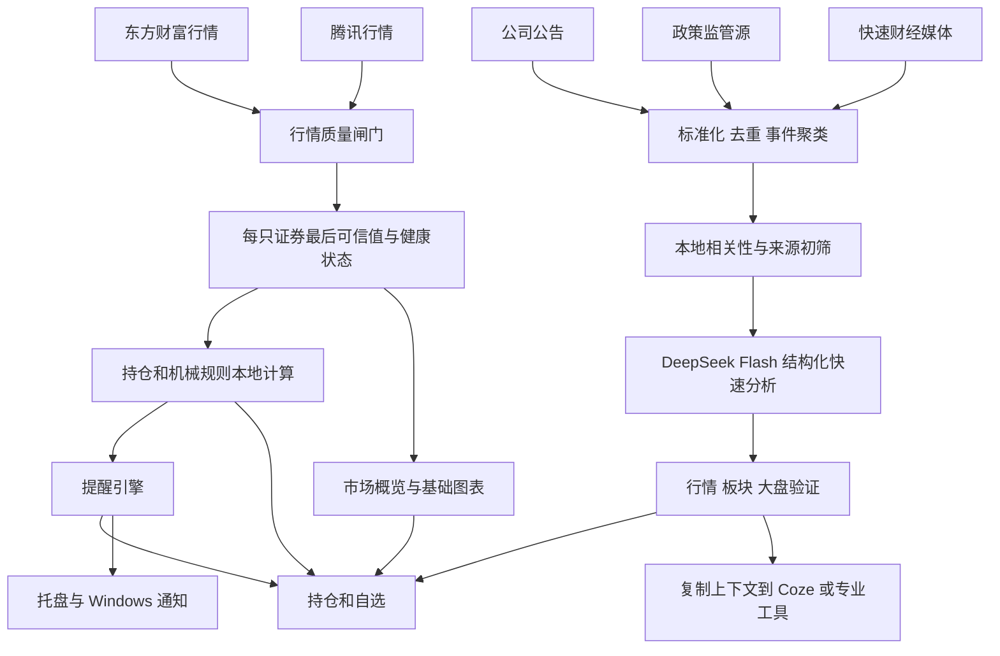

# 个人悬浮看盘二轮优化方案

> 状态：阶段 0–6 已实施；阶段 7 轻量版开发中
> 日期：2026-07-10
> 适用范围：个人 Windows 办公场景；偶尔看一眼行情、持仓变化和重要事件
> 前置文档：`docs/2026-07-10-personal-stock-widget-optimization-plan.md`

## 1. 二轮目标与产品边界

本应用不是缩小版专业行情软件，不替代券商终端，也不承接完整的个人交易体系和深度研究工作。它要解决的是办公时间低干扰地偶尔看一眼：

1. 现在市场和持仓发生了什么。
2. 行情数据是否及时、完整、可信。
3. 哪些本地可机械计算的价格、盈亏和风险规则被触发。
4. 哪些新闻真正与持仓或自选有关，可能通过什么机制产生影响。
5. 什么时候无需处理，什么时候值得进入专业行情软件或 Coze 做进一步分析。

产品定位收敛为：

> 一个低调、可随时呼出、后台持续监控的个人行情与事件速览层；本地程序负责确定性计算，DeepSeek V4 Flash 负责快速筛选和简短解释，Coze 与专业行情软件负责深度分析和专业数据。

### 1.1 成功标准

- 正常状态下，用户在 5–10 秒内判断市场状态、持仓变化和是否存在待处理事项。
- 没有重要事件或规则触发时，应用允许保持安静，不用普通新闻和提示填满窗口。
- 数据异常时明确显示延迟、停滞、冲突或缓存状态，不能伪装成实时数据。
- 所有价格和金额类规则由本地代码计算，不让大模型重复计算确定性结果。
- 应用提供基础市场视图和图表，但详细行情、专业金融数据和深度研究仍交由外部工具。

### 1.2 明确边界

本轮不把应用扩展成：

- 完整行情终端、盘口工具或量化交易平台。
- 券商账户同步、自动下单或条件单替代品。
- 完整的交易日志、开仓检查、盘前深度预警和盘后研究系统。
- Coze 专业金融 Agent 的重复实现。
- 由 AI 直接给出买入、卖出或仓位命令的投资顾问。

## 2. 工具分工

### 2.1 本地应用负责

- 实时行情、数据时间、来源和健康状态。
- 持仓、自选、市场和基础图表。
- 今日盈亏、累计盈亏、市值、持仓内贡献和相对表现。
- 用户预先设定的止损线、观察线、价格、金额和风险组阈值计算。
- 告警状态、回差、冷却、去重和持久化。
- 新闻标准化、去重、聚类、缓存和任务调度。
- 将当前上下文整理为可复制的深度分析材料。

### 2.2 DeepSeek V4 Flash 负责

- 新闻与持仓、自选的相关性判断。
- 事件类型、方向、影响周期和重要度抽取。
- 收入、成本、供需、估值、风险偏好等传导机制的简短解释。
- 反向因素、不确定性和证据不足的说明。
- 异动更偏个股、板块还是大盘因素的快速初判。

DeepSeek 不负责：

- 计算盈亏、仓位、R、距离阈值和技术指标。
- 自行制定止损价和观察线。
- 深度基本面研究、盘前策略和开仓检查。
- 直接输出买卖结论。

### 2.3 Coze 与专业行情软件负责

- 专业金融数据库查询。
- 盘前预警、开仓检查和深度公司/行业研究。
- 复杂行情归因、宏观分析和完整证据链。
- 更详细的 K 线、盘口、财务和研报信息。

本应用后续只提供“复制当前上下文”或“打开深度分析入口”，不重复建设 Coze 已有能力。

## 3. 默认信息架构

默认显示四个 Tab：

1. `持仓`
2. `自选`
3. `市场`
4. `AI驱动`

默认进入 `持仓`。四个 Tab 均允许重命名、排序和隐藏；自定义 Tab 继续采用模板，而不是自由画布。

### 3.1 持仓

回答“我的持仓有什么变化”：

- 当前价和今日涨跌幅。
- 今日盈亏金额、累计盈亏金额和比例。
- 对持仓合计今日盈亏的贡献。
- 持仓市值及持仓内占比；不知道现金时不得称为真实账户仓位。
- 距止损线、观察线和金额阈值的距离。
- `未触发 / 接近 / 已触发 / 无法计算` 状态。
- 最多 1–2 条与该持仓直接相关的重要事件。

### 3.2 自选

- 用户配置的字段、排序和股票子集。
- 当前价、涨跌幅、成交额等基础字段。
- 可选异常标记和提醒入口。
- 点击股票进入复用的图表详情页。

### 3.3 市场

回答“市场现在表现如何”：

- 上证指数、深证成指、创业板指和一个可自定义指数。
- 上涨、下跌和平盘家数。
- 涨停、跌停家数。
- 沪深成交额及相对昨日同期变化。
- 少量领涨、领跌行业。
- 市场状态与判断依据，禁止只输出无依据的“强/弱”。
- 选中指数的紧凑分时图。

### 3.4 AI驱动

- 只展示经过筛选的重要事件。
- 默认最多 5 条；无重要事件时显示“暂无重要驱动”。
- 每条事件包括事实、相关标的、方向、周期、机制、证据、反向因素和置信依据。
- 新闻原文可点击打开。

## 4. 窗口、托盘与快捷键

### 4.1 默认设置

- 始终置顶：开启。
- 仅在系统托盘显示：开启。
- 老板键：开启，默认 `Ctrl+Alt+S`，允许自定义。
- 点击穿透：保留用户上次设置。
- 默认尺寸约 `380 × 520`，允许用户调整并持久化。

### 4.2 置顶行为

- `始终置顶` 可在设置和托盘菜单切换。
- 关闭后窗口作为普通窗口；老板键呼出时只带到前面一次，不永久置顶。
- 打开设置窗口时主窗口临时取消置顶；关闭设置后恢复用户设置。

### 4.3 仅托盘驻留

- 主窗口可见时不占任务栏。
- 老板键隐藏后只保留托盘图标。
- 设置窗口也不单独占任务栏，但打开时必须可靠获得焦点并位于主窗口前方。
- 托盘始终保留显示/隐藏、置顶、点击穿透、设置和退出入口。

### 4.4 自定义老板键

- 必须包含至少一个修饰键。
- 主键限定为稳定按键，如字母、数字或 F1–F12。
- 禁止危险或系统保留组合。
- 新快捷键注册失败时保留旧快捷键，并明确提示冲突。
- 隐藏时同时隐藏设置窗口；再次呼出只恢复主窗口。
- 不改变当前 Tab、点击穿透、透明度和主题。

### 4.5 窗口可靠性

- 单实例运行，防止重复托盘、重复轮询和快捷键冲突。
- 记住窗口位置、尺寸和显示器。
- 显示器拓扑变化后将窗口拉回可见区域。
- 增加锁定位置或边缘吸附，避免误拖动。

## 5. 行情准确性、及时性与 fallback

### 5.1 当前来源定位

- 东方财富作为首选快速行情源。
- 腾讯作为备用行情源。
- 两者按“无 SLA 的尽力而为网页型来源”处理。
- 后续保留接入正式或授权行情源的适配器接口，但个人阶段不强制购买。

### 5.2 数据质量闸门

每轮行情不能仅以“HTTP 成功且结果非空”作为成功标准，必须校验：

- 请求证券覆盖率。
- 证券代码、市场和数据源时间。
- 交易时段数据时间是否持续推进。
- 最新价、最高价、最低价和昨收之间的基本关系。
- 成交量和成交额是否出现异常倒退。
- 涨跌额、涨跌幅和昨收是否可相互验证。
- 两来源之间是否存在显著价格或单位冲突。

### 5.3 按证券粒度的 fallback

```text
东方财富批量请求
  ↓
完整性与新鲜度校验
  ├─ 完整且可信 → 使用
  ├─ 部分缺失 → 只向腾讯请求缺失证券
  ├─ 时间停滞或异常 → 腾讯并行复核
  └─ 整体失败 → 腾讯接管
          ↓
两源均不可用或冲突
          ↓
保留每只证券最后可信值 + 明确标记陈旧/冲突 + 禁止价格类提醒
```

- 不允许部分结果覆盖整批可信行情。
- 不随意混合不同来源同一证券的价格和成交量字段；优先按证券整体选源。
- 主源失效后采用粘性备用；主源连续健康若干次后再切回，避免振荡。

### 5.4 来源健康评分

记录每个来源的：

- 成功率。
- 完整率。
- 源时间新鲜度。
- 响应延迟 P50/P95。
- 解析失败率。
- 与其他来源差异率。

### 5.5 刷新策略

- 交易时段约 8 秒，午休和收盘后约 60 秒。
- 主源超过短延迟仍未完成时，可启动备用对冲请求。
- 保持 single-flight，禁止轮询重叠。
- 加少量随机抖动，降低固定周期软封风险。
- 电脑唤醒、网络恢复和手动刷新后立即请求。
- 页面必须区分最近请求时间、源数据时间和最近数值变化时间。

## 6. 市场 Tab 与基础图表

### 6.1 两层视图

- 市场 Tab 默认显示指数卡、市场广度、成交额、行业概览和一张紧凑分时图。
- 点击指数或股票后，在当前悬浮窗内进入全页详情，不另开大型窗口。
- 详情页提供 `分时 / 日K / BOLL` 和返回按钮。
- 持仓、自选和市场指数复用同一图表组件。

### 6.2 首版图表范围

- 当日 1 分钟分时。
- 最近 60 或 120 个交易日的日K。
- 成交量柱。
- 标准 BOLL：20 日均线，上下 2 倍标准差。
- 股票日K默认前复权并明确标注；指数不复权。

不在本轮扩展 MACD、KDJ、RSI、盘口和复杂画线工具。

### 6.3 图表数据调度

- 图表按需加载，不同时抓取全部自选的历史数据。
- 分时首次加载完整当日数据，之后增量更新最后一分钟。
- 日K历史数据本地缓存；当日K线由实时开高低收和成交量补齐。
- BOLL 由本地根据日K确定性计算。
- 历史行情与实时行情采用独立健康状态；图表失败不能拖垮实时行情。

### 6.4 图表 fallback

- 历史主源失败时切换备用源。
- 两源失败时使用本地缓存并标记历史数据陈旧。
- 校验最后一根K线与实时行情是否明显冲突。
- 缓存只作为降级显示，不伪装成实时图表。

## 7. 本地机械规则与提醒

### 7.1 接入范围

只接入能够从当前持仓、行情和用户固定参数确定计算的规则：

- 当前市值。
- 今日盈亏、累计盈亏和 R 表示。
- 距止损价、观察线和价格阈值的距离。
- 是否达到观察线或用户设定的利润金额。
- 单一持仓金额上限。
- 持仓数量上限。
- 总持仓市值占账户基准比例。
- 风险组合计浮盈亏和设定阈值。
- 持仓合计今日盈亏与停手提醒阈值。

不在首版承接需要完整成交流水或人工纪律记录的周开仓次数、违规判定、开仓检查和交易日志。

### 7.2 用户输入

- 账户基准和 1R。
- 单一持仓上限、持仓数量上限和可选总持仓比例上限。
- 每只持仓的止损价、观察线和是否启用提醒。
- 风险组成员和组级金额阈值。
- 可选备注或持有逻辑；该字段只供展示和 Coze 上下文，不由本地代码解释。

### 7.3 提醒类型

首版建议支持：

- 价格向上突破或向下跌破。
- 今日涨跌幅达到阈值。
- 单只持仓今日盈亏金额。
- 单只持仓累计盈亏金额或比例。
- 持仓合计今日盈亏。
- 距止损线或观察线进入预警区。
- 风险组合计浮盈亏。

后续可增加：

- 成交速度或相对同期成交额异常。
- 个股相对板块、大盘的强弱偏离。
- BOLL 突破并伴随成交量确认。
- 高重要度持仓事件。

### 7.4 提醒引擎要求

- 使用穿越阈值触发，不在条件持续成立时每轮重复通知。
- 支持回差和重新武装，避免阈值附近反复触发。
- 支持冷却时间、仅一次、交易时段限制和暂停至下一交易日。
- 数据延迟、停滞、冲突或缺失时禁止价格类提醒。
- 提醒状态跨重启持久化。
- 通知渠道可选：悬浮窗高亮、托盘状态、Windows 通知；默认无声音。
- 仅说明触发了哪条用户规则，不生成规则外买卖动作。

### 7.5 影子运行

机械规则初次接入时先进入影子模式：

- 只计算和记录，不主动给出交易动作。
- 与用户现有 AI 或人工计算结果对照。
- 区分数据差异、公式差异和规则定义差异。
- 确定性计算稳定后再开启正式提醒。

## 8. 新闻来源与事件层

### 8.1 来源分层

一级：法定和官方披露

- 巨潮资讯。
- 上交所、深交所、北交所公司公告。
- 公司官方网站和投资者关系页面。

二级：监管、政策和宏观官方源

- 证监会、中国人民银行、国家统计局和中国政府网政策文件。
- 根据持仓行业配置相关部委和监管来源。

三级：快速财经媒体

- 东方财富 7×24 继续作为快速市场事件入口。
- 其他专业媒体连接器只在遵守使用条款、限流和来源标注的前提下补充。

社交媒体仅可作为线索，不能直接形成高置信事件。

### 8.2 新闻 fallback

- 巨潮资讯失败时按证券市场回退到对应交易所公告。
- 快讯主源失败时保留历史事件，并切换备用媒体连接器。
- 正文抓取失败时可以保留标题事件，但降低置信度，禁止升级为高优先级确定性结论。
- DeepSeek 失败时事件保持待分析并退避重试，不永久标记完成。
- 无模型时可启用明确标注的本地规则降级，但不能伪装成 AI 筛选。

### 8.3 标准化、去重与聚类

- URL、规范化标题和正文指纹去重。
- 公司代码、实体、时间窗口和语义相似度聚类。
- 同一公告及其多篇转载合并为一张事件卡片。
- 以原始公告作为事实根节点，媒体报道作为背景或解读来源。
- 对澄清、监管问询和后续进展形成事件时间线。

## 9. DeepSeek 快速分析协议

### 9.1 配置与安全

- 设置页支持 DeepSeek 官方和自定义 OpenAI-compatible 服务。
- API Key 由 Electron 主进程通过 `safeStorage` 加密保存。
- 渲染进程只能获得是否已配置和掩码。
- 默认 `deepseek-v4-flash`，显式发送 `thinking.type=disabled`。
- 支持测试连接、超时、清除 Key 和最近成功状态。

### 9.2 处理方式

- 先本地去重、相关性和来源等级初筛。
- 将少量新事件批量发送给 Flash。
- 使用 JSON Output，并进行本地 Schema 校验、范围校验、空响应重试和截断检查。
- 事件指纹级缓存，避免重复计费。
- 高重要度但证据冲突的事件可异步进行第二次独立复核，不阻塞首次展示。

### 9.3 输出结构

```json
{
  "useful": true,
  "eventType": "earnings|policy|order|management|capital|industry|market|other",
  "relatedCodes": ["000000"],
  "relation": "direct|industry|market|uncertain",
  "direction": "positive|negative|neutral|mixed",
  "horizon": "intraday|short|medium|long",
  "importance": 0,
  "confidence": 0,
  "summary": "发生了什么",
  "mechanism": "通过什么路径影响",
  "evidence": ["来源事实"],
  "counterFactors": ["反向因素或不确定性"],
  "missingInformation": ["仍缺少什么"]
}
```

模型的自报 `confidence` 不能直接作为最终置信度。最终分数还需结合来源等级、直接性、材料性、跨来源一致性和市场验证。

### 9.4 隐私边界

- 不向 DeepSeek 发送数量、成本价、账户规模和完整持仓组合。
- 模型只分析事件本身和必要的公开代码。
- 持仓权重、金额影响和提醒优先级在本地计算。

## 10. 影响与传导分析

### 10.1 四层分析

1. 事实层：主体、事件、金额、时间、状态和原始证据。
2. 材料性层：合同/收入、回购/市值、减持/股本等确定性比例由本地程序计算。
3. 机制层：收入、成本、毛利率、现金流、供需、稀释、估值和风险偏好。
4. 市场验证层：个股相对板块、大盘、成交量和事件前后时间关系。

### 10.2 输出边界

最终只允许使用：

- 市场表现与该潜在机制一致。
- 市场表现暂不支持。
- 信息不足。
- 可能已被提前反映。

不得把公开新闻与价格相关性表述为确定因果。

### 10.3 相对表现

为每只持仓或自选建立：

- 相对主要指数强弱。
- 相对所属行业强弱。
- 成交量、成交额和波动变化。
- 事件发布前后的 5/15/60 分钟表现。

关系图中的子公司、客户、供应商和竞争对手必须来自可靠资料或本地人工配置，不能让模型临时编造。

## 11. Coze 深度分析交接

首版不直接集成 Coze API，先提供可控的上下文复制：

- 标的名称和代码。
- 当前行情、数据来源和时间。
- 今日涨跌和相对板块/大盘表现。
- 触发的本地规则。
- 相关事件标题、原文链接、来源和时间。
- DeepSeek 快速分析及其不确定性。

数量、成本和账户信息默认不复制；用户明确选择后才包含。

后续可增加用户自定义的 Coze 页面或应用入口，但不在本地重复建设专业数据库。

## 12. 目标数据模型

```text
WindowPreferences
  alwaysOnTop
  trayOnly
  bossKeyEnabled
  bossKeyAccelerator
  clickThrough
  bounds
  locked

PositionRule
  securityCode
  stopPrice
  watchPrice
  riskGroupId
  alertsEnabled
  note

RiskGroup
  id
  title
  securityCodes
  lossThreshold

AlertRule
  id
  scope
  securityCode
  metric
  operator
  threshold
  confirmation
  cooldownMs
  hysteresis
  marketHoursOnly
  channels
  armed
  lastTriggeredAt

ProviderHealth
  provider
  successRate
  completenessRate
  latencyP95
  freshnessMs
  discrepancyRate
  circuitState

CandleSeries
  securityCode
  interval
  adjustment
  candles
  source
  updatedAt
  stale

NewsDocument
  sourceId
  sourceTier
  title
  body
  url
  publishedAt
  fetchedAt
  fingerprint

Event
  eventId
  relatedCodes
  documentIds
  eventType
  firstSeenAt
  lastUpdatedAt
  status

FastAnalysis
  eventId
  schemaVersion
  model
  result
  analyzedAt
  retryState
```

设置继续使用 JSON；事件、分析缓存、提醒状态和分钟聚合数据建议转为本地 SQLite。实时行情不保存每个 8 秒快照，只保存变化或分钟聚合，避免无意义膨胀。

## 13. 总体处理架构



## 14. 分阶段实施计划

### 阶段 0：收口第一轮开发状态

- 审核当前未提交改动。
- 完成持仓、Tab、行情刷新和布局的开发态验收。
- 运行全量测试、构建、真实行情 smoke 和隐私扫描。
- 形成一个清晰提交，作为二轮开发基线。

验收：工作区基线明确，个人配置未进入 Git，开发态无“无数据”和窗口遮挡回归。

### 阶段 1：窗口、托盘和老板键

- 增加置顶开关、仅托盘、自定义老板键和冲突反馈。
- 单实例、窗口位置持久化、多显示器恢复和锁定位置。
- 托盘提供完整恢复与退出入口。

验收：任务栏可隐藏；老板键稳定显示/隐藏；快捷键冲突不会造成窗口不可恢复。

### 阶段 2：行情质量与 fallback

- 数据质量闸门、按证券 fallback、最后可信值和冲突状态。
- 来源健康评分、熔断、粘性切换和恢复探测。
- 交易时段、休市和节假日状态完善。

验收：部分缺失不清空其他证券；HTTP 200 旧数据能被识别；两源失败时保留旧数据并禁止提醒。

### 阶段 3：市场 Tab 与基础图表

- 接入指数、市场广度、成交额和少量行业数据。
- 完成分时、日K、成交量和 BOLL 详情页。
- 历史数据缓存、按需加载和独立 fallback。

验收：市场页默认可见；指数和个股可进入详情；图表失败不影响实时行情。

### 阶段 4：机械规则与提醒

- 配置账户基准、1R、止损/观察线、风险组和金额阈值。
- 完成本地确定性计算、提醒状态机、回差、冷却和持久化。
- 先以影子模式对照人工或现有 AI 结果。

验收：相同输入始终得到相同结果；数据异常时不触发；跨重启不重复告警。

### 阶段 5：AI 设置与 DeepSeek 快速分析

- safeStorage、DeepSeek 预设、测试连接和非思考模式。
- JSON Output、Schema 校验、重试、缓存和批处理。
- 严格限制为快速相关性、事件和机制分析。

验收：渲染进程拿不到 Key；错误不泄露凭据；无模型时明确降级；模型不输出买卖命令。

### 阶段 6：新闻来源与事件层

- 接入巨潮资讯和交易所公告。
- 增加政策监管来源和可控的媒体备用连接器。
- 持久化事件、跨来源去重、聚类和失败重试。

验收：重大公告能覆盖持仓；同一事件只显示一次；单一来源失败不丢历史。

实施记录（2026-07-11）：

- 已接入巨潮、上交所、深交所、证监会和东方财富快讯；巨潮按证券代码失败时回退交易所。
- 已使用 Electron 内置 SQLite 持久化文档、事件、来源健康和 AI 退避状态。
- 已实现 URL/标题/代码/标题相似度聚类，官方公告优先作为事实根节点。
- 已增加真实 `npm run smoke:news`：验证五个来源、官方原文链接和跨源合并。
- 北交所公司公告当前由巨潮法定披露覆盖；北交所官网独立回退连接器留待实际持有北交所标的时补充验证。

### 阶段 7：轻量决策提示与 Coze 交接

- 本地计算“留意 / 核验 / 立即查看”，表达查看优先级而非买卖建议。
- 只使用现有行情描述个股当前相对主要指数表现，不计算事件窗口收益，不声称因果。
- 卡片保留一条影响路径、一个关键不确定点和一个下一步核验动作。
- 一键复制脱敏上下文给 Coze；默认排除数量、成本、账户规模和完整持仓组合。
- 公告正文提取改为后续按需能力，不后台全量抓取 PDF。

本阶段不开发板块归因、事件前后 5/15/60 分钟统计、回测、复杂材料性模型或自动交易动作。

验收：用户五秒内能判断事件是否值得现在点开、当前市场是否已有明显反应，以及下一步去哪里核验。

### 阶段 8：最终导入与长期运行验收

- 提供明确的“替换当前持仓/自选”导入入口，不依赖首次 seed。
- 用户在开发完成后重新导入真实持仓与规则。
- 完成 Windows 长时间运行、睡眠唤醒、断网恢复、显示器变化和托盘回归测试。

验收：真实数据导入可回滚；运行一个完整交易日无明显卡顿、重复提醒和数据丢失。

## 15. 验证体系

### 15.1 自动化验证

- 配置迁移和隐私边界测试。
- 行情解析、完整性、新鲜度和跨源差异测试。
- fallback、熔断、粘性切换和恢复测试。
- 市场时段和节假日测试。
- K线、前复权标记、分钟增量和 BOLL 计算测试。
- 机械规则、回差、冷却和跨重启告警测试。
- 新闻去重、聚类、重试和缓存测试。
- DeepSeek JSON Schema、空响应、截断和错误脱敏测试。

### 15.2 真实 smoke

- 当前配置证券 100% 返回。
- 每只证券包含可验证源时间。
- 指数、分时和日K能够读取并与实时价基本一致。
- 主动模拟主源失败并确认备用接管。
- 真实新闻源至少返回一个可打开原文的事件。

### 15.3 GUI 验收

- 标准与低调模式。
- 不同透明度、尺寸和 Windows 缩放比例。
- 仅托盘、置顶、老板键、点击穿透和设置窗口。
- 四个默认 Tab 和图表详情返回。
- 数据延迟、停滞、冲突、无重要新闻和提醒触发状态。

## 16. 关键指标

- 行情覆盖率：请求证券 100%。
- 正常交易时段数据新鲜度：可识别并解释超时，不以本机请求时间伪装源时间。
- fallback：主源部分缺失时不影响其他证券，备用只补缺失或异常项。
- 告警重复率：同一穿越事件在冷却和回差条件下不重复。
- 重大公告发现延迟：以个人工具可接受的分钟级目标为准。
- 新闻默认页精度：前 1–3 条以“真正值得看”为首要指标，而非召回全部新闻。
- AI结构化成功率：失败可重试、可降级，不产生半截或不可解析结果。
- 长时间运行：一个完整交易日无轮询堆积、内存明显增长和托盘失效。

## 17. 已确认决策与后续确认点

### 17.1 已确认

- 个人办公时间偶尔查看，不追求替代专业行情软件。
- 默认四个 Tab：持仓、自选、市场、AI驱动。
- 市场页需要基本指数、市场表现、分时、日K和 BOLL。
- 始终置顶可配置；默认开启。
- 仅托盘驻留可配置；默认开启。
- 老板键默认开启且可自定义。
- 本地负责机械计算，DeepSeek Flash 负责快速反馈，Coze 负责深度分析。
- 不展示大量未经筛选的普通新闻。
- 开发完成后重新导入真实持仓和规则，当前开发数据不作为最终验收依据。

### 17.2 实施前仍需逐项确认

- 首版机械规则的精确定义和公式，尤其是今日盈亏、1R触发和风险组口径。
- 提醒默认渠道、冷却时间和回差参数。
- 第四个默认市场指数。
- 分时与日K备用来源的具体选择。
- Coze 交接首版采用纯复制文本还是同时提供自定义入口。
- 真实持仓最终导入格式：手工、JSON、CSV或多方式并存。

## 18. 参考入口

- 巨潮资讯：<https://www.cninfo.com.cn/>
- 上海证券交易所公告：<https://www.sse.com.cn/disclosure/listedinfo/announcement/>
- 深圳证券交易所公告：<https://www.szse.cn/disclosure/notice/company/index.html>
- 北京证券交易所公告：<https://www.bse.cn/disclosure/announcement.html>
- 中国证监会：<https://www.csrc.gov.cn/>
- 中国人民银行：<https://www.pbc.gov.cn/>
- 国家统计局：<https://www.stats.gov.cn/>
- 中国政府网政策文件：<https://www.gov.cn/zfwj/search.htm>
- DeepSeek Thinking Mode：<https://api-docs.deepseek.com/guides/thinking_mode>
- DeepSeek JSON Output：<https://api-docs.deepseek.com/guides/json_mode/>
